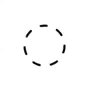

</a> 
<br>

# TransitionalLoader

A simple UIView extension to easily convert any UIView subclass into an animated loader.

[](https://cocoapods.org/pods/TransitionalLoader)
[](https://cocoapods.org/pods/TransitionalLoader)
[](https://cocoapods.org/pods/TransitionalLoader)


Table of Content
------------

* [Requirements](#requirements)
* [Installation](#Installation)
* [Usage](#usage)
* [License](#license)

Requirements <a name="requirements"></a>
------------

* iOS 10.+
* Swift 4.2+


Installation <a name="Installation"></a>
------------

### CocoaPods

```ruby
pod 'TransitionalLoader'
```

or include this project inside yours.

Usage <a name="usage"></a>
--------
* It's very easy to use this framework with your project, just import the framework 
```swift
import TransitionalLoader
```
and call:
```swift
view.startLoader()
```
and the library will take care of the rest.


* You can also give the loader a color and specify how you'd like the loader to stop if the user taps on it:
```swift
public func startLoader(color: UIColor?, onTapWhileLoading: FinishState?)
```
By default, if no color is provided it'll use the borderColor, backgroundColor, tintColor, or green depending on the value with the same mentioned order. <br>
Also, by default the loader isn't tappable unless a `FinishState` is provided. <br>


* To stop the loader just call:
```swift
public func stopLoader(finishState: FinishState, animationCompletion: (()->Void)?)
```
<br>


* Finally, you can apply any `CGAffineTransfor` to the laoder using: 
```swift
public func transformLoader(_ transformation: CGAffineTransform)
```

License <a name="license"></a>
--------

Reel Search is released under the MIT license.
See [LICENSE](./LICENSE) for details.
